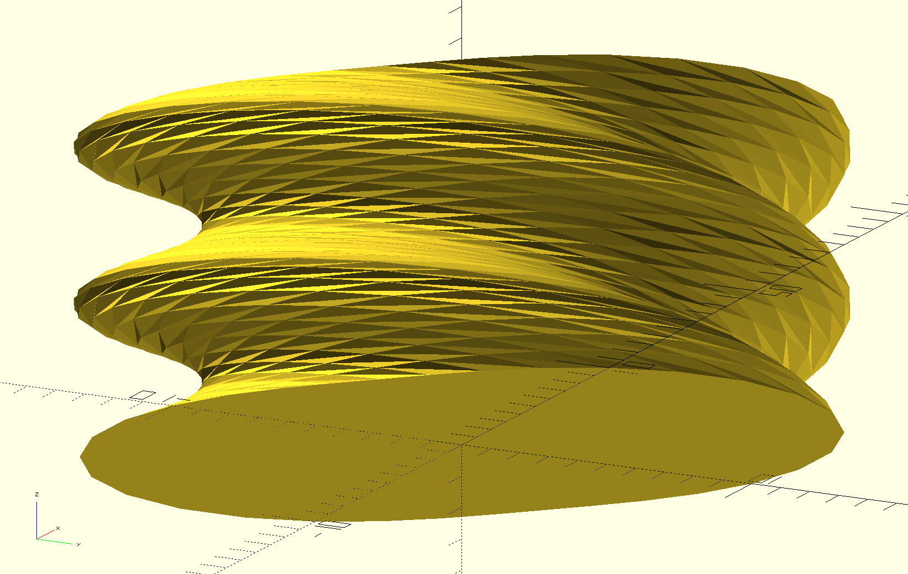
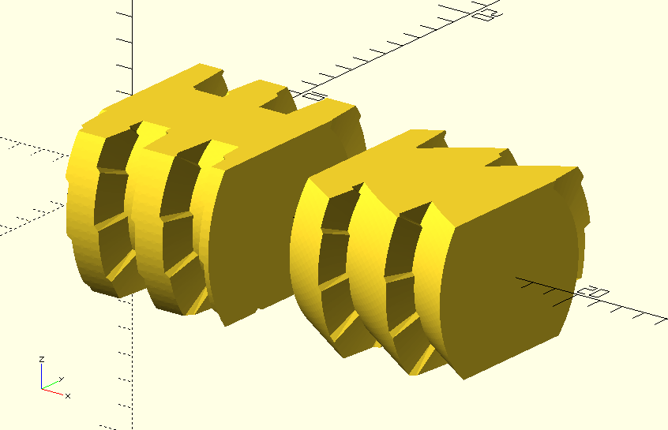

Up: [README.md](README.md)  

# Addressed and remaining issues

OpenSCADs default linear_extrude(hetght=...,twist=...) is not usable because of the following:  

<!---  --->

Not a nice triangulation. A spikey mess.  
Here especially well visible at the perimeter on the left.

**The causing factors:**  

* Screw threads typically have low pitch compared to the screw circumference  
* OpenSCADs linear_exrude(..) directly connects vertices on one sampling height to the rotated vertices on the next sampling height.  
Even when the twist per sampling-height-step becomes a good part of a full reolution.

**Both of these together lead to:**  

* Triangles getting massively sheared out circumferencially. One gets highly degenerate triangles.  
* Picked out pairs of two adjacent triangles that share one edge become so heavily sheared that the 
hinge-point between these two triangles becomes highly concave leading to the whole triangulation of the thread becoming a spikey mess. 
The only way to prevent that would be to **pick unreasonably high axial sampling denstities**.  
But that would:  (1) make OpenSCAD unusably slow,  (2) make file sizes wastefully big and  (3) may give problems in subsequent slicing of the stl-file to the gcode-file 
=> **Not a viable option**. 
* Triangulation triangles start taking secant shortcuts though the screw instead of approximating the desired screws shape with a nice tangential fit.

One could call this problem : "hyperbolic necking"  
Since it is similar to twisting a cylinder of wires such that it becomes a hyperboloid.  

## The chosen solution

Implement an alternate triangulation. 
Sample the radii r for a fixed raster of the other two cylindrical coordinates (r,h). 
This is now independent of the geometry of the screw. 
In a factored out module that could potentially also be used for other things than screws.

## The new problem

Unfortunately it was overlooked that this does not work for all thread profiles equally well. 
Check out this fail:

<!---  --->

Not a nice triangulation. A steppy mess.  

Especially profiles with high slopes in their cross section are not well handeled. 
One gets bad axial jumps in the thread wherever an axial sampling z-height is crossed over. 

**The problem:**  

* the constant height triangulation triangle stripes are crossing over (C0 or C1) discontinuities of the thread profile in a very shallow angle

**What is effected?**  

* Maximally susceptible are square wave profiles and sawtooth profiles. Followed by steep trapezoidal profiles.  
* Also circular profiles suffer a bit because they have small spots where their derivative becomes infinite.  
* Sine profiles and cubic osculating profiles do not face a problem. 
I'd recommens sticking to these for now. 

# Plans

**Eventually TODO** Replace the triangulation module with one 
that uses a sampling in screw coordinates matching the pitch of the screw. 
Without OpenSCADs linear_extrude(...) shearing problem. 

# Rant about fundamental limitations

OpenSCAD is a pure but not a functional language. That is: 

* **pure:** a function always returns the same output given the same input (unlike imperative languages like python) – awesome  
* **not functional:** functions cannot take as arguments other unevaluated functions  There are no "higher-order functions".  Functions are not [first class citizens](https://en.wikipedia.org/wiki/First-class_citizen). – pretty bad  

Due to the latter making an OpenSCAD library parametric in thread profiles is necessarily a hack. 
OpenSCADs lack of records and lack of any proper data structures makes this worse.  

